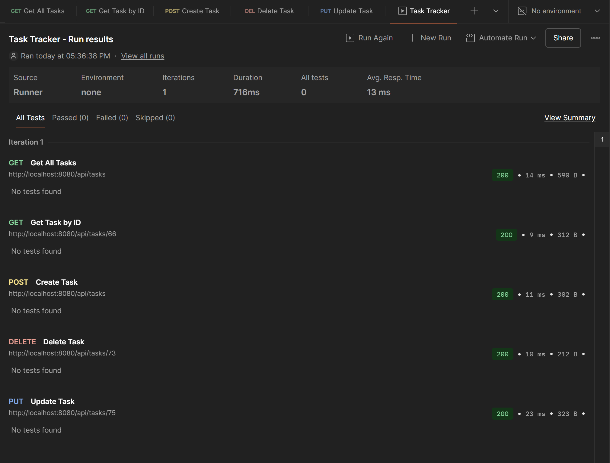

\# 📋 Task Tracker - Görev Takip Uygulaması


\## 📖 Proje Hakkında


Bu proje, Türksat stajım öncesinde hazırlanmış bir full-stack görev takip uygulamasıdır.

Amaç, React.js ve Spring Boot teknolojileri ile temel CRUD işlemlerini gerçekleştiren, PostgreSQL veritabanına bağlı bir web uygulaması geliştirmektir.


\### API Testleri





\##  Özellikler


\- ✅ \*\*Tam CRUD İşlemleri\*\*: Görev ekleme, listeleme, güncelleme ve silme

\- ✅ \*\*RESTful API\*\*: Spring Boot backend ile tamamen fonksiyonel API

\- ✅ \*\*PostgreSQL Entegrasyonu\*\*: Docker ile containerized veritabanı

\- ✅ \*\*Modern React Frontend\*\*: Component-based architechture

\- ✅ \*\*API Integration\*\*: Axios ile backend işlemleri


\##  Kullanılan Teknolojiler


\### Frontend


\- \*\*React.js\*\* (19.1.1) - UI library

\- \*\*Vite\*\* - Build tool ve development server

\- \*\*JavaScript\*\*

\- \*\*CSS\*\* - Styling

\- \*\*Axios\*\* - HTTP client for API calls


\### Backend


\- \*\*Spring Boot\*\* - RESTful web service framework

\- \*\*Java 21\*\* - Programming language

\- \*\*Spring Data JPA\*\* - Database operations

\- \*\*Spring Web\*\* - Web layer

\- \*\*Maven\*\* - Dependency management


\### Database


\- \*\*PostgreSQL 15\*\* - Production database

\- \*\*Docker\*\* - Database containerization


\### Testing \& Development


\- \*\*Postman\*\* - API testing

\- \*\*ESLint\*\* - Code linting


\## 📁 Proje Yapısı


```

task-tracker/

├── frontend/                 # React uygulaması

│   ├── src/

│   │   ├── components/      # React bileşenleri

│   │   │   ├── Header.jsx

│   │   │   ├── TaskForm.jsx

│   │   │   ├── TaskList.jsx

│   │   │   └── TaskItem.jsx

│   │   ├── services/        # API servisleri

│   │   │   └── taskService.js

│   │   ├── App.jsx         # Ana uygulama

│   │   ├── main.jsx        # Entry point

│   │   └── App.css         # Stiller

│   ├── public/

│   ├── package.json

│   └── vite.config.js

├── backend/                 # Spring Boot projesi

│   ├── src/

│   │   └── main/

│   │       ├── java/

│   │       │   └── com.metehanayhan.TaskTracker/

│   │       │       ├── TaskTrackerApplication.java

│   │       │       ├── controller/

│   │       │       ├── entity/

│   │       │       ├── repository/

│   │       │       └── service/

│   │       └── resources/

│   │           └── application.properties

│   └── pom.xml

│   

├── images/             # Uygulama ekran görüntüleri

└── README.md

```


\## ⚙️ Kurulum ve Çalıştırma


\### Ön Gereksinimler


\- \*\*Node.js\*\*

\- \*\*Java 21\*\*

\- \*\*Docker Desktop\*\*

\- \*\*npm\*\*

\- \*\*Git\*\*


\### 1. Projeyi Klonlayın


```bash

git clone https://github.com/metehanayhan/Turksat-Task-Tracker.git

cd turksat-task-tracker

```


\### 2. PostgreSQL Veritabanı Kurulumu


```bash

\# PostgreSQL Docker container başlatma

docker run --name task-postgres \\

&nbsp; -e POSTGRES\_DB=taskdb \\

&nbsp; -e POSTGRES\_USER=taskuser \\

&nbsp; -e POSTGRES\_PASSWORD=taskpass \\

&nbsp; -p 5432:5432 \\

&nbsp; -d postgres:15

```


\### 3. Backend Kurulumu


```bash

\# Backend dizinine gidin

cd backend


\# Maven ile projeyi build edin

./mvnw clean install


\# Spring Boot uygulamasını başlatın

./mvnw spring-boot:run

```


Backend `http://localhost:8080` adresinde çalışacaktır.


\#### IntelliJ IDEA Üzerinden


\- backend klasörünü IntelliJ IDEA ile açın.

\- Proje otomatik olarak Maven projesi olarak tanınacaktır. Eğer tanımazsa pom.xml dosyasına sağ tıklayın → Add as Maven Project.

\- Sol üstteki menüden TaskTrackerApplication.java dosyasını açın (src/main/java/com/tasktracker/TaskTrackerApplication.java).

\- public static void main metodunun yanındaki yeşil ▶️ (Run) butonuna tıklayın.

\- Backend yine http://localhost:8080 üzerinde çalışacaktır.


\### 4. Frontend Kurulumu


```bash

\# Frontend dizinine gidin

cd frontend


\# Bağımlılıkları yükleyin

npm install


\# Development server'ı başlatın

npm run dev

```

\#### VS Code Üzerinden


\- frontend klasörünü VS Code ile açın.

\- Terminal → New Terminal açın.

\- Yukarıdaki komutları (npm install, ardından npm run dev) çalıştırın.

\- VS Code terminal çıktısında çalıştığı URL gözükür (http://localhost:5173)


\### 5. Uygulamayı Açın


Tarayıcınızda `http://localhost:5173` adresine gidin.


\## 📡 API Endpoints


| Method | Endpoint          | Açıklama            | Status    |

| ------ | ----------------- | ------------------- | --------- |

| GET    | `/api/tasks`      | Tüm görevleri getir | ✅ Tested |

| GET    | `/api/tasks/{id}` | ID ile görev getir  | ✅ Tested |

| POST   | `/api/tasks`      | Yeni görev ekle     | ✅ Tested |

| PUT    | `/api/tasks/{id}` | Görev güncelle      | ✅ Tested |

| DELETE | `/api/tasks/{id}` | Görev sil           | ✅ Tested |


\## 🗄️ Veritabanı Bilgileri


\*\*PostgreSQL Configuration:\*\*


\- \*\*Database:\*\* taskdb

\- \*\*Username:\*\* taskuser

\- \*\*Password:\*\* taskpass

\- \*\*Port:\*\* 5432

\- \*\*Host:\*\* localhost


\## 📄 Lisans


Bu proje eğitim amaçlı olarak oluşturulmuştur ve Türksat stajı ödev gereksinimlerini karşılamak üzere geliştirilmiştir.


---


