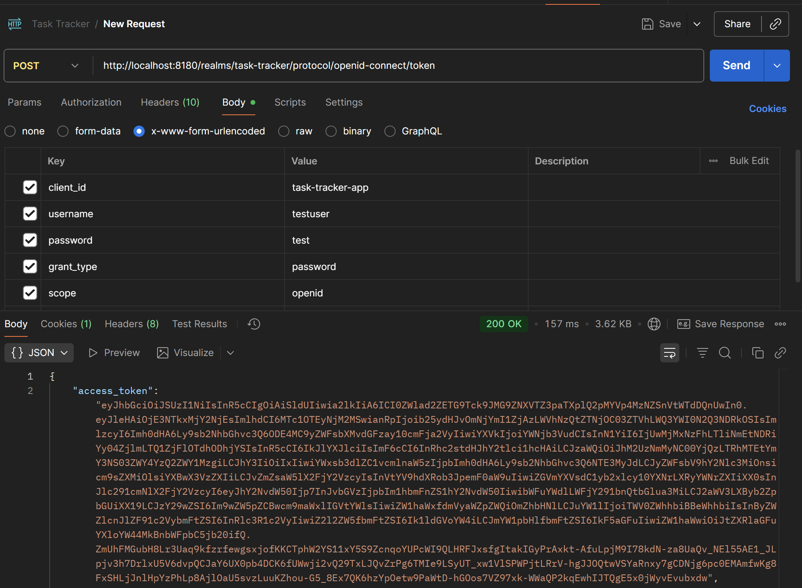
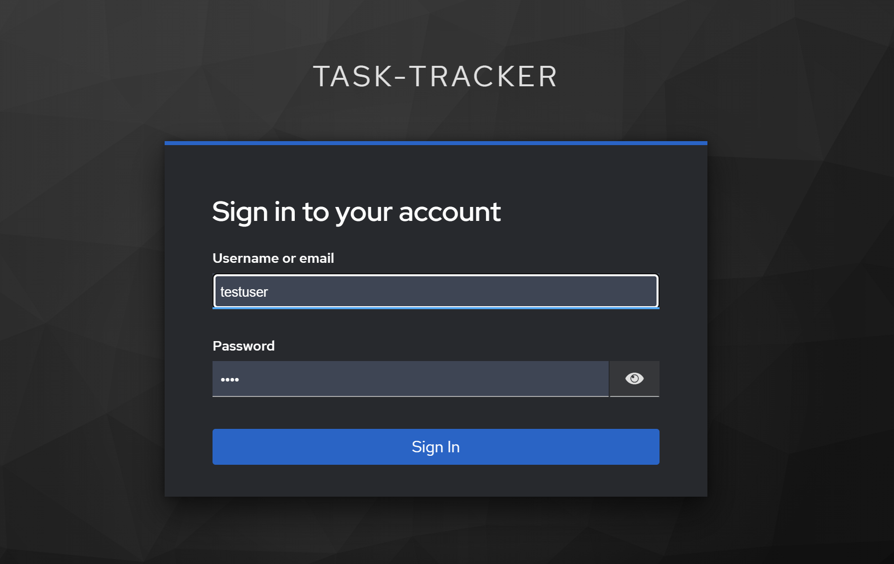
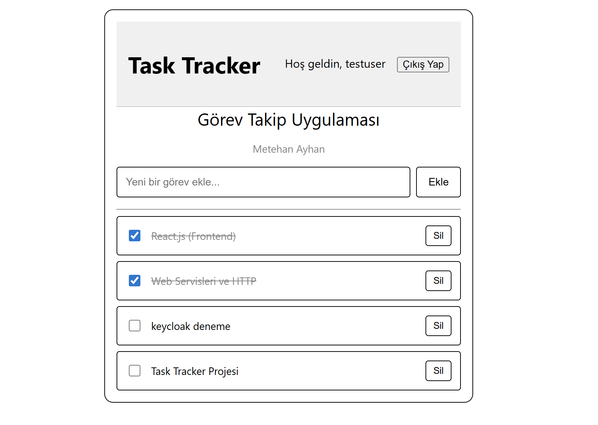

# 📋 Türksat - Task Tracker


## 📖 Proje Hakkında

Bu proje, Spring Boot ve React.js ile geliştirilmiş full-stack görev takip uygulamasıdır. Temel CRUD (Create, Read, Update, Delete) işlevselliğinin yanı sıra, Keycloak ile entegre edilerek merkezi bir kimlik doğrulama ve yetkilendirme katmanına sahiptir. Backend mimarisinde DTO (Data Transfer Object) ve MapStruct kullanılarak verimli ve güvenli bir veri transferi sağlanmıştır.

Tüm altyapı servisleri (PostgreSQL ve Keycloak) tek bir Docker Compose komutuyla ayağa kaldırılacak şekilde tasarlanmıştır.


## 🎥 Postman

### API Testleri




### Giriş



### Uygulama




##  Özellikler

- ✅ **Tam CRUD İşlemleri**: Görev ekleme, listeleme, güncelleme ve silme
- ✅ **RESTful API**: Spring Boot backend ile tamamen fonksiyonel API
- ✅ **PostgreSQL Entegrasyonu**: Docker ile containerized veritabanı
- ✅ **Modern React Frontend**: Component-based architechture
- ✅ **API Integration**: Axios ile backend işlemleri
- ✅ **DTO (Data Transfer Object)**: Backend'de DTO ve MapStruct ile optimize edilmiş ve güvenli veri transferi.
- ✅ **Kimlik Doğrulama & Yetkilendirme**: Keycloak ile güvenli kullanıcı girişi ve rol bazlı API koruması.

##  Kullanılan Teknolojiler

### Frontend

- **React.js** (19.1.1) - UI library
- **Vite** - Build tool ve development server
- **JavaScript**
- **CSS** - Styling
- **Axios** - HTTP client for API calls
- **@react-keycloak/web** - Keycloak Entegrasyon Kütüphanesi

### Backend

- **Spring Boot** - RESTful web service framework
- **Java 21** - Programming language
- **Spring Data JPA** - Database operations
- **Spring Web** - Web layer
- **Maven** - Dependency management

### Database

- **PostgreSQL 15** - Production database
- **Docker** - Database containerization

### Testing & Development

- **Postman** - API testing
- **ESLint** - Code linting

## 📁 Proje Yapısı

```
task-tracker/
├── frontend/                 # React uygulaması
│   ├── src/
│   │   ├── components/      # React bileşenleri
│   │   │   ├── Header.jsx
│   │   │   ├── TaskForm.jsx
│   │   │   ├── TaskList.jsx
│   │   │   └── TaskItem.jsx
│   │   ├── services/        # API servisleri
│   │   │   └── taskService.js
│   │   ├── App.jsx         # Ana uygulama
│   │   ├── main.jsx        # Entry point
│   │   └── App.css         # Stiller
│   ├── public/
│   ├── package.json
│   └── vite.config.js
├── backend/                 # Spring Boot projesi
│   ├── src/
│   │   └── main/
│   │       ├── java/
│   │       │   └── com.metehanayhan.TaskTracker/
│   │       │       ├── TaskTrackerApplication.java
│   │       │       ├── controller/
│   │       │       ├── entity/
│   │       │       ├── repository/
│   │       │       └── service/
│   │       └── resources/
│   │           └── application.properties
│   └── pom.xml
│   
├── images/             # Uygulama ekran görüntüleri
└── README.md
```

## ⚙️ Kurulum ve Çalıştırma

### Ön Gereksinimler

- **Node.js**
- **Java 21**
- **Docker Desktop**
- **npm**
- **Git**

### 1. Projeyi Klonlayın

```bash
git clone https://github.com/metehanayhan/Task-Tracker-SpringBoot-React.git
cd Task-Tracker-SpringBoot-React
```

### 2. PostgreSQL Veritabanı Kurulumu

```bash
# PostgreSQL Docker container başlatma
docker run --name task-postgres \
  -e POSTGRES_DB=taskdb \
  -e POSTGRES_USER=taskuser \
  -e POSTGRES_PASSWORD=taskpass \
  -p 5432:5432 \
  -d postgres:15
```

### 3. Backend Kurulumu

```bash
# Backend dizinine gidin
cd backend

# Maven ile projeyi build edin
./mvnw clean install

# Spring Boot uygulamasını başlatın
./mvnw spring-boot:run
```

Backend `http://localhost:8080` adresinde çalışacaktır.

#### IntelliJ IDEA Üzerinden

- backend klasörünü IntelliJ IDEA ile açın.
- Proje otomatik olarak Maven projesi olarak tanınacaktır. Eğer tanımazsa pom.xml dosyasına sağ tıklayın → Add as Maven Project.
- Sol üstteki menüden TaskTrackerApplication.java dosyasını açın (src/main/java/com/tasktracker/TaskTrackerApplication.java).
- public static void main metodunun yanındaki yeşil ▶️ (Run) butonuna tıklayın.
- Backend yine http://localhost:8080 üzerinde çalışacaktır.

### 4. Frontend Kurulumu

```bash
# Frontend dizinine gidin
cd frontend

# Bağımlılıkları yükleyin
npm install

# Development server'ı başlatın
npm run dev
```
#### VS Code Üzerinden

- frontend klasörünü VS Code ile açın.
- Terminal → New Terminal açın.
- Yukarıdaki komutları (npm install, ardından npm run dev) çalıştırın.
- VS Code terminal çıktısında çalıştığı URL gözükür (http://localhost:5173)

### 5. Uygulamayı Açın

Tarayıcınızda `http://localhost:5173` adresine gidin.

## 📡 API Endpoints

| Method | Endpoint          | Açıklama            | Status    |
| ------ | ----------------- | ------------------- | --------- |
| GET    | `/api/tasks`      | Tüm görevleri getir | ✅ Tested |
| GET    | `/api/tasks/{id}` | ID ile görev getir  | ✅ Tested |
| POST   | `/api/tasks`      | Yeni görev ekle     | ✅ Tested |
| PUT    | `/api/tasks/{id}` | Görev güncelle      | ✅ Tested |
| DELETE | `/api/tasks/{id}` | Görev sil           | ✅ Tested |


## 🗄️ Veritabanı Bilgileri

**PostgreSQL Configuration:**

- **Database:** taskdb
- **Username:** taskuser
- **Password:** taskpass
- **Port:** 5432
- **Host:** localhost


## 📄 Lisans

Bu proje eğitim amaçlı olarak oluşturulmuştur.

---
